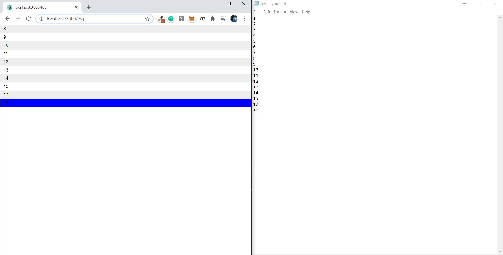

# Tail-f-Nodejs-App
A NodeJS App to keep track of changes in a file and get the last 10 lines of the file in real time using socket.io on web Interface.

TechStack Used: NodeJS, Express.js,  Socket.io

## Installing the project

```bash
git clone https://github.com/kjain3474/Tail-f-Nodejs-App.git
npm install
```
## Start

```bash
npm start

On Browser
http://localhost:3000/log
```

## ScreenShot

